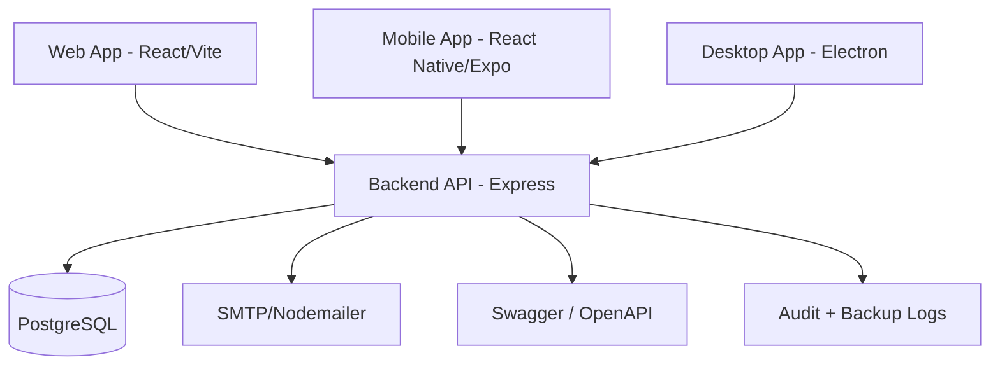
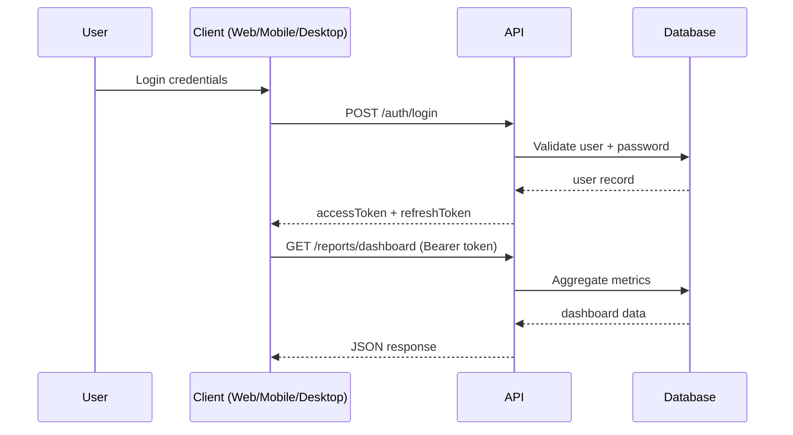
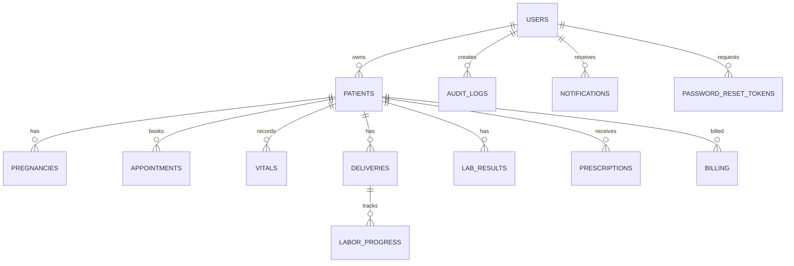
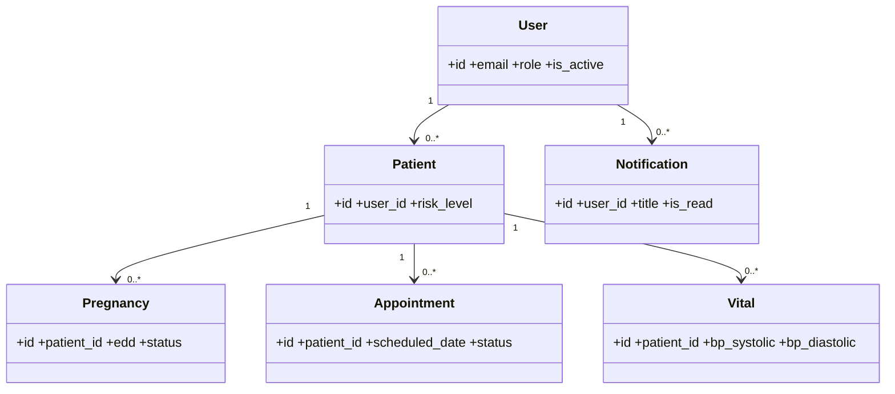
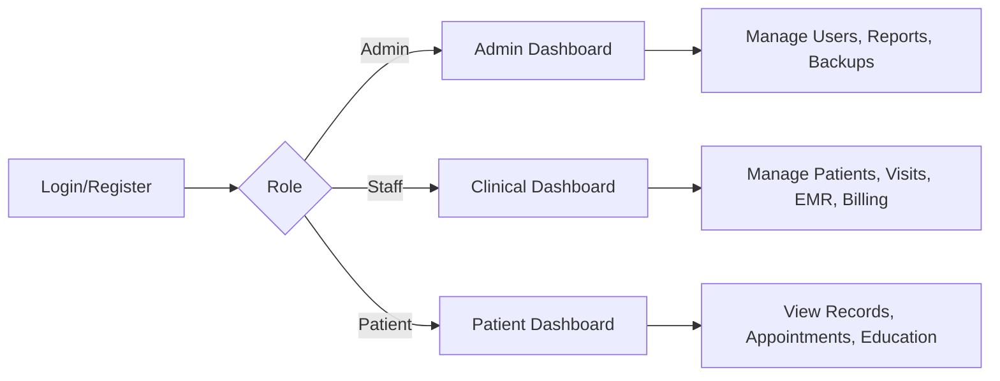

# 1. System Summary
This package delivers one integrated MWOS platform where Web, Mobile, and Desktop clients share the same `Node.js + Express + PostgreSQL` backend, auth, and business rules. It includes role-based access (Admin, Staff, User/Patient), full authentication lifecycle (login/register/forgot/reset), CRUD modules, reports dashboard, notifications, activity logs, and backup/restore operations.

# 2. Architecture Diagram


Additional behavioral sequence (auth + dashboard):


# 3. Tools & Technologies
- Frontend Web: React 18, Vite, TailwindCSS, Zustand, React Query, Recharts
- Backend: Node.js, Express, PostgreSQL (`pg`), JWT, bcrypt, rate-limit, Helmet, Swagger
- Mobile: React Native (Expo), React Navigation, React Query, Zustand
- Desktop: Electron + Axios + localStorage offline notes
- DevOps: Docker, Docker Compose, Nginx reverse proxy
- Testing/QA tools: Postman collection, Swagger OpenAPI docs
- IDE/tooling: VS Code recommendations in `.vscode/extensions.json`

# 4. Database Schema (with ERD)
Core tables:
- `users`, `patients`, `pregnancies`, `appointments`, `vitals`, `deliveries`, `labor_progress`
- `lab_results`, `ultrasounds`, `prescriptions`, `postpartum_records`, `immunizations`
- `inventory`, `billing`, `education_content`
- `audit_logs`, `password_reset_tokens`, `notifications`, `backup_logs`

ERD:


# 5. API Endpoints
Base URL: `/api`

Auth:
- `POST /auth/login`
- `POST /auth/register`
- `POST /auth/forgot-password`
- `POST /auth/reset-password`
- `POST /auth/refresh`
- `POST /auth/logout`
- `GET /auth/me`

Admin/Users:
- `GET /users`
- `PATCH /users/:id/toggle`

Patients & Clinical:
- `GET/POST /patients`
- `GET /patients/:id`
- `PATCH /patients/:id`
- `GET /patients/:id/summary`
- `GET/POST /pregnancies`
- `GET/POST/PATCH /appointments`
- `POST /vitals`, `GET /vitals/patient/:patientId`
- `POST /deliveries`, `GET /deliveries/patient/:patientId`
- `POST /deliveries/:deliveryId/labor-progress`

EMR & Operations:
- `GET/POST /emr/labs`, `GET/POST /emr/ultrasounds`, `GET/POST /emr/prescriptions`
- `GET/POST /education`
- `GET/POST/PATCH /billing`
- `GET/POST/PATCH /inventory`

Reports + Monitoring + Logs:
- `GET /reports/dashboard`
- `GET /reports/patient-dashboard`
- `GET /reports/audit-logs`
- `GET/POST /notifications`
- `PATCH /notifications/:id/read`
- `POST /admin/backup`
- `POST /admin/restore`
- `GET /admin/backup-logs`

API docs:
- `GET /api/docs` (Swagger UI)
- `GET /api/openapi.json`

# 6. Frontend Code Templates
Implemented in:
- `frontend/src/App.jsx` (routing + role-guard)
- `frontend/src/store/authStore.js` (auth, register, forgot/reset)
- `frontend/src/store/themeStore.js` (dark mode)
- `frontend/src/components/common/AppLayout.jsx` (admin/user panels + theme switch)

Sample auth call pattern:
```js
const res = await api.post('/auth/login', { email, password })
const { accessToken, refreshToken, user } = res.data.data
```

# 7. Backend Code Templates
Implemented in:
- `backend/src/index.js` (security middleware + swagger)
- `backend/src/routes/index.js` (versioned API entry)
- `backend/src/controllers/auth.controller.js` (login/register/forgot/reset)
- `backend/src/controllers/notification.controller.js`
- `backend/src/controllers/operations.controller.js`
- `backend/src/middleware/activityLogger.js`

# 8. Mobile App Templates
Implemented in:
- `mobile/src/navigation/RootNavigator.js`
- `mobile/src/services/api.js`
- patient/staff screens under `mobile/src/screens/`

Offline support included:
- GET response caching fallback in `mobile/src/services/api.js` via AsyncStorage

# 9. Desktop App Templates
Implemented in:
- `desktop/main.js`, `desktop/preload.js`
- `desktop/renderer/index.html`
- `desktop/renderer/app.js`
- `desktop/renderer/styles.css`

Features:
- Login to shared backend
- Dashboard fetch example
- Offline draft notes using local storage
- Dark mode toggle

# 10. Deployment Guide
Containerized:
- `docker-compose.yml` starts `postgres`, `backend`, `frontend`
- `backend/Dockerfile`, `frontend/Dockerfile`, `infra/nginx.conf`

Manual environments:
- Backend can be deployed to Render/Fly/Railway/EC2
- Frontend can be deployed to Vercel/Netlify/Nginx
- Mobile via Expo EAS (Android/iOS)
- Desktop by packaging Electron for Windows/macOS

# 11. Complete File/Folder Structure
```text
mwos/
  backend/
    src/
      config/{database.js,schema.sql,swagger.js}
      controllers/{auth,patient,vitals,appointment,delivery,report,notification,operations}.controller.js
      middleware/{auth,errorHandler,activityLogger}.js
      routes/index.js
      utils/{migrate,seed,mailer}.js
    .env
    Dockerfile
  frontend/
    src/
      components/common/
      pages/
      store/{authStore,themeStore}.js
      utils/api.js
      App.jsx
    Dockerfile
  mobile/
    src/{navigation,screens,services,components,hooks}
  desktop/
    main.js
    preload.js
    renderer/{index.html,app.js,styles.css}
  docs/COMPLETE_SYSTEM_PACKAGE.md
  postman/MWOS_Complete.postman_collection.json
  infra/nginx.conf
  docker-compose.yml
  .vscode/extensions.json
```

# 12. How to Run Locally + Production
Local (manual):
1. Backend
   - `cd backend && npm install`
   - `npm run migrate && npm run seed`
   - `npm run dev`
2. Frontend
   - `cd frontend && npm install && npm run dev`
3. Mobile
   - `cd mobile && npm install --legacy-peer-deps && npx expo start`
4. Desktop
   - `cd desktop && npm install && npm run dev`

Local (Docker):
1. `docker compose up --build`
2. Frontend: `http://localhost:3000`
3. API: `http://localhost:5000/api`
4. Swagger: `http://localhost:5000/api/docs`

Production checklist:
1. Set strong `JWT_SECRET` and `JWT_REFRESH_SECRET`
2. Use managed PostgreSQL + encrypted backups
3. Configure SMTP credentials
4. Enable HTTPS and secure CORS origins
5. Run migrations in CI/CD before app rollout
6. Monitor logs, API latency, and backup success/failure

## 13. Use Case Diagram (Text)
- Admin: manage users, backups, reports, notifications
- Staff (Doctor/Midwife/Nurse): clinical CRUD, appointments, EMR, inventory
- Patient/User: own dashboard, appointments, records, profile

## 14. Class Diagram (Core Domain)


## 15. Flowchart (High-level)


## 16. Scope Notes and Final Statement
This manuscript is the canonical system-level reference for MWOS. It captures the shared backend contract, platform responsibilities, domain model, deployment path, and operating principles for the current repository.

If implementation changes introduce new workflows, security controls, or data domains, update this manuscript first so the web, mobile, desktop, and backend surfaces remain aligned.
