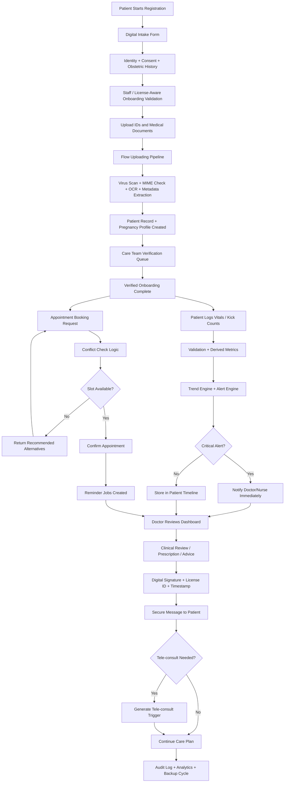

# MWOS Production-Ready Architecture

## TMC Copino Maternal Wellness and Operation System

This document defines the production target for MWOS as a clinic-grade maternal care platform covering onboarding, prenatal monitoring, scheduling, communications, document handling, analytics, administration, and security governance.

It is intentionally aligned to the current repository direction:

- Backend: `Node.js + Express + PostgreSQL`
- Web: `React + Tailwind + React Query`
- Desktop: `Electron` wrapping the same web application shell
- Mobile: `React Native + Expo` with the same design tokens, API contracts, and navigation logic

## 1. Executive Design Decision

### UI/UX Parity Rule

Absolute parity is achieved by one canonical design system, not by manually recreating screens three times.

Production MWOS should use:

- one shared brand token set
- one shared component contract
- one shared navigation map
- one shared form schema layer
- one shared domain logic layer

### Parity Architecture

Use a monorepo-style structure:

```text
mwos/
  apps/
    web/
    desktop/
    mobile/
  packages/
    design-tokens/
    ui/
    forms/
    domain/
    api-client/
    charts/
```

### Parity Implementation Logic

- `web` and `desktop` must render the same React routes and layout system.
- `desktop` should not maintain a separate renderer UX. Electron should host the same web shell used by the browser app.
- `mobile` must consume the same screen definitions, validation rules, API hooks, and design tokens through shared packages.
- responsive behavior must be rule-based:
  - mobile: stacked card layout
  - tablet: two-column adaptive layout
  - desktop: multi-panel layout
- the workflow order, labels, permissions, and business logic must be identical across platforms.

## 2. Recommended Production Stack

### Client Layer

- Web: `React`, `Vite`, `TailwindCSS`, `TanStack Query`, `Zustand`
- Desktop: `Electron` using the web build as the main shell
- Mobile: `React Native + Expo`, plus shared token package and shared business/domain hooks

### Server Layer

- API: `Node.js`, `Express`, `PostgreSQL`
- Realtime messaging and alerts: `Socket.IO`
- Background jobs: `BullMQ` or `Bull` with `Redis`
- Object/file storage: `AWS S3` with signed URLs
- CDN: `CloudFront` or equivalent for optimized download of large media

### Integrations

- SMS: `Twilio`
- Email: `Amazon SES` or `Resend`
- OCR: `AWS Textract` or `Google Vision`
- Tele-consult trigger: `Twilio Video`, `Zoom`, or `Jitsi`
- Observability: `Sentry`, `Winston`, `OpenTelemetry`, `Grafana`

## 3. System Architecture and RBAC

### Hierarchical Permission Model

MWOS must enforce credential-aware RBAC, not just simple role labels.

That means:

- a `Midwife` cannot access physician-only diagnosis and prescribing actions
- a `Nurse` can log vitals and review permitted history, but cannot sign prescriptions
- an `Admin` can manage schedules, billing, user provisioning, and analytics, but cannot freely browse sensitive clinical vitals unless a clinical-operations permission is explicitly granted
- all clinical writes are attributable to both a user account and a verified professional credential

### Staff Identity and License Registry

Every clinical professional profile must be backed by a verified license record.

Required fields:

- legal full name
- professional role
- license ID
- license type
- issuing authority
- verification status
- verification timestamp
- account status

### Role Matrix

| Role | Core Access | Restricted Actions |
|---|---|---|
| Doctor / Specialist | Full diagnosis, prescriptions, risk review, doctor notes, tele-consult approval | Cannot perform admin-only financial configuration unless separately assigned |
| Nurse | Vital sign logging, patient history view, prenatal follow-up tasks, reminders | Cannot prescribe, finalize doctor diagnosis, or delete records |
| Midwife | Prenatal records, labor monitoring, postpartum tracking, care coordination, vital logging | Cannot execute physician-only prescribing or diagnosis actions |
| Admin | Scheduling, billing, staff management, reporting, license verification workflow, audit review | Restricted medical detail view unless specific clinical access policy is granted |
| Patient | Personal dashboard, uploads, messaging, education, self-logging | No access to other users or internal staff workflows |

### Access Evaluation Rule

Every sensitive action must pass:

1. active session check
2. account status check
3. role permission check
4. credential verification check when action is clinical
5. step-up auth check when action is critical

## 4. Integrated Security Framework

### Authentication Layers

- password or passkey as base login
- mobile biometrics for supported devices
- WebAuthn or platform authenticator for web and compatible desktops
- SMS OTP for critical actions
- digital signature binding for chart entries

### Biometric and MFA Model

#### Face Recognition (Mobile-First)

- use device-native biometric APIs
- never store raw face data in the MWOS database
- rely on secure device keystore and signed credential assertions

#### Fingerprint for Desktop and Web

- prefer `WebAuthn`, `Windows Hello`, `Touch ID`, or vendor-supported workstation biometrics
- if USB fingerprint scanners are used, integrate through approved device middleware and pass a signed verification result to MWOS

#### SMS OTP for Critical Actions

Critical actions include:

- updating high-risk status
- deleting records
- changing license verification
- restoring backups
- exporting sensitive records

#### Digital Signature Model

Every clinical chart entry should be signed with:

- `staff_id`
- `license_id`
- `credential_strength`
- `timestamp`
- immutable signature hash

### Safer Biometric Storage Design

The proposed `Biometric_Template_Hash` field is not the preferred production design for healthcare systems.

Safer production approach:

- store credential metadata and public-key references
- keep biometric matching on the device or trusted authenticator
- persist:
  - credential ID
  - authenticator type
  - public key or attestation reference
  - last verified timestamp

This reduces liability and better matches modern passkey/WebAuthn style authentication.

## 5. Functional Feature Inventory

## 5.1 Automated Patient Onboarding

### Purpose

Digitize intake for expectant mothers and reduce repeated manual data entry.

### Logic

1. Patient starts registration from mobile, web, or clinic kiosk mode.
2. System collects identity, emergency contacts, obstetric history, allergies, medications, consent, and insurance.
3. Dynamic forms reveal additional fields only when relevant:
   - previous pregnancy complications
   - high-risk factors
   - multiple gestation
   - prior cesarean history
4. Uploaded IDs and supporting files are pushed into the document flow pipeline.
5. OCR extracts fields from PhilHealth ID, Birthing ID, and government ID.
6. Extracted values are shown back to the patient or registrar for confirmation before final save.
7. A patient record, pregnancy profile, onboarding checklist, and audit log are created in one transaction.
8. The care team receives a verification task if any document remains unverified.

### Production Rules

- all intake steps are resumable drafts
- every draft autosaves locally and server-side
- every final submission creates immutable audit history
- intake forms are role-aware:
  - self-service patient
  - nurse-assisted registration
  - admin-assisted registration

## 5.2 Health Tracking Suite

### Purpose

Provide continuous maternal monitoring with fast interpretation by both patient and clinician.

### Data Points

- blood pressure
- weight
- fetal kick counts
- fetal movement notes
- temperature
- edema
- symptoms and warning signs

### Logic

1. Patient or staff submits vitals.
2. Validation rules check range and unit consistency.
3. Backend computes derived indicators:
   - BMI
   - blood pressure category
   - kick count thresholds
   - high-risk escalation flags
4. Trend service stores denormalized chart points for quick dashboard loading.
5. Rules engine generates alerts:
   - severe hypertension
   - absent fetal movement
   - rapid weight increase
   - postpartum warning symptoms
6. Clinician dashboard highlights only abnormal or deteriorating trends first.
7. Patient dashboard shows simplified guidance and action prompts.

### Trend Analysis Requirements

- line charts for BP and weight
- daily kick count trend graph
- threshold overlays
- anomaly markers
- last 7-day and 30-day summaries

## 5.3 Advanced File and Document Management

### Purpose

Support secure, large, multi-format clinical uploads through a reliable "Flow Uploading" pipeline.

### Supported Content

- ultrasound images
- lab result PDFs
- prescriptions
- consent forms
- DICOM/JPG/PNG/PDF

### Flow Uploading Logic

1. Client obtains a signed upload policy from the API.
2. File uploads go directly to S3 multipart upload for large assets.
3. Upload record is created with status `pending_processing`.
4. Background workers perform:
   - antivirus scan
   - MIME validation
   - metadata extraction
   - thumbnail generation
   - OCR or text extraction
   - document classification
5. Processed files are linked to:
   - patient
   - visit
   - pregnancy
   - prescription
   - lab result
6. Staff can verify or reject the document.
7. Every file change is versioned and audited.

### Required UX

- drag and drop on web and desktop
- tap upload on mobile
- chunked progress bar
- retry for failed chunks
- preview panel
- verification badge
- filter by patient, type, date, and status

## 5.4 Smart Scheduling

### Purpose

Prevent double-booking while maintaining the proper prenatal visit cadence.

### Logic

1. Patient selects preferred appointment date/time.
2. Scheduler checks:
   - provider availability
   - room capacity
   - clinic holidays
   - overlapping appointments
   - equipment/resource conflicts
3. Prenatal rules engine proposes recommended visit spacing based on gestational age.
4. If the requested slot conflicts, alternatives are returned immediately.
5. Confirmation creates:
   - appointment record
   - reminder jobs
   - care-team notification
6. Reminder jobs send:
   - SMS
   - email
   - in-app notification
7. Missed appointments trigger rebooking workflow and follow-up prompts.

### Conflict-Check Rules

- no provider can have overlapping confirmed slots
- room and procedure resources are capacity-bound
- emergency slots remain reserved
- high-risk patients receive priority override logic

## 5.5 Doctor and Patient Portal

### Purpose

Create a secure care communication channel with escalation to tele-consult when needed.

### Logic

1. Each patient has care threads scoped to pregnancy or case context.
2. Messages are role-aware and permission-checked.
3. Urgent symptom keywords or flagged vitals can trigger tele-consult prompts.
4. Tele-consult trigger generates:
   - meeting link
   - notification to provider
   - case note placeholder
5. All clinical communications become part of the patient audit trail when marked clinical.

### Portal Capabilities

- secure messaging
- attachment sharing
- care task assignment
- tele-consult initiation
- read receipts
- escalation routing

## 5.6 Additional Operational Features

| Feature | Description | Platform Parity |
|---|---|---|
| Biometric Gateway | Face or fingerprint login with shared credential-strength logic | Mobile, Web, Desktop |
| License Validator | Real-time professional ID verification via centralized API | All staff surfaces |
| Flow Uploading | Drag-and-drop or tap upload with resumable chunking and verification status | Web, Desktop, Mobile |
| Patient Health Dashboard | Live BP, weight, fetal movement, kick count, reminders, and chart trends | Fully responsive |
| SMS Alert System | Appointment reminders, urgent risk escalation, and OTP challenges | Backend-driven, client-visible |
| Audit Trail | Immutable log of staff access and sensitive operations | Admin and compliance view |

## 6. Module Architecture

| Module | Purpose | Key Features |
|---|---|---|
| Patient Module | Mother's interface | Personal dashboard, pregnancy milestone tracker, kick counter, reminders, document upload, educational feed |
| Clinical Module | Doctor/Nurse interface | Patient history, vitals trend review, digital prescriptions, risk alerts, tele-consult triggers |
| Admin Module | Clinic operations | Staff management, role controls, analytics, system logs, backups, audit review |
| Media Module | File handling | Flow Uploading, image/PDF processing, DICOM support, secure previews, verification workflow |

## 7. Technical Database Logic

Production MWOS should model security and credential state explicitly.

### Recommended Core Security Tables

```sql
CREATE TABLE staff_registry (
    staff_id UUID PRIMARY KEY,
    user_id UUID UNIQUE NOT NULL,
    full_name VARCHAR(100) NOT NULL,
    role VARCHAR(20) NOT NULL CHECK (role IN ('Doctor', 'Nurse', 'Midwife', 'Admin')),
    license_id VARCHAR(50) UNIQUE NOT NULL,
    license_type VARCHAR(50) NOT NULL,
    issuing_authority VARCHAR(100) NOT NULL,
    verification_status VARCHAR(30) NOT NULL CHECK (
        verification_status IN ('Pending_Verification', 'Verified', 'Suspended', 'Expired')
    ),
    verified_at TIMESTAMPTZ,
    account_status VARCHAR(30) NOT NULL CHECK (
        account_status IN ('Active', 'Suspended', 'Pending_Verification')
    ),
    mobile_number VARCHAR(20) UNIQUE,
    created_at TIMESTAMPTZ NOT NULL DEFAULT NOW(),
    updated_at TIMESTAMPTZ NOT NULL DEFAULT NOW()
);

CREATE TABLE security_audit (
    log_id BIGSERIAL PRIMARY KEY,
    staff_id UUID REFERENCES staff_registry(staff_id),
    action_performed VARCHAR(255) NOT NULL,
    entity_type VARCHAR(50),
    entity_id UUID,
    timestamp TIMESTAMPTZ NOT NULL DEFAULT NOW(),
    device_ip VARCHAR(45),
    auth_method VARCHAR(30) NOT NULL CHECK (
        auth_method IN ('Password', 'Biometric', 'SMS_OTP', 'WebAuthn', 'Passkey')
    ),
    credential_strength VARCHAR(30) NOT NULL CHECK (
        credential_strength IN ('Base', 'Step_Up', 'Clinical_Signature')
    )
);
```

### Additional Recommended Tables

- `license_verification_events`
- `auth_credentials`
- `webauthn_credentials`
- `otp_challenges`
- `digital_signatures`
- `upload_sessions`
- `document_versions`
- `teleconsult_sessions`

### Database Design Rule

Use PostgreSQL `CHECK` constraints or lookup tables for role/status state where future expansion is expected. Avoid overusing rigid enum types if frequent policy evolution is likely.

## 8. Reliability and Performance Design

## 8.1 Error Handling

Literal "zero-bug" is not a realistic engineering claim, so the production goal should be:

- zero unhandled exceptions
- zero invalid writes
- zero silent failures
- zero untraceable incidents

### Backend Controls

- global exception middleware with standardized JSON error envelope
- correlation IDs on every request
- transactional writes for multi-step operations
- queue retry policies with dead-letter handling
- idempotency keys for critical write endpoints

### Frontend and Mobile Controls

- schema validation before submit using shared form schemas
- optimistic updates only for low-risk actions
- rollback on failed mutation
- field-level and form-level error messaging
- offline queue for patient-side low-risk entries
- resumable upload state machine for large file transfers

### Security Wrapper for Sensitive Calls

All sensitive API calls should pass through a centralized authorization wrapper:

```ts
authorizeClinicalAction({
  sessionActive,
  accountStatus,
  role,
  permissionCode,
  credentialVerified,
  stepUpRequired,
  stepUpSatisfied,
})
```

It must answer:

- is the session active?
- is the credential valid?
- does the role permit the action?
- does the action require biometric or OTP step-up?

## 8.2 Performance

### Caching Strategy

- `TanStack Query` client cache for dashboards, messages, schedules, and patient summaries
- `Redis` server cache for:
  - dashboard aggregates
  - schedule slot availability
  - provider lists
  - report summaries
- signed URL caching for large file previews
- background chart precomputation for trend-heavy screens

### Low-Latency Patterns

- denormalized read models for dashboards
- pagination for documents and messages
- presigned direct uploads to S3
- partial hydration of large patient timelines
- websocket push for alerts and message badges
- chunked upload resume tokens for interrupted large-file transfers

## 9. Security and Compliance-Oriented Design

This design is compliance-oriented, not a legal certification by itself. Final HIPAA or Data Privacy compliance still requires policy review, vendor review, security testing, and legal sign-off.

### Core Safeguards

- TLS in transit
- AES-256 encrypted storage at rest
- field-level encryption for highly sensitive identifiers
- role-based access control
- credential-based access control for licensed staff actions
- minimum-necessary data access
- automatic session expiry
- device-aware login alerts
- full audit logging
- document access logging
- backup encryption
- disaster recovery testing

### Identity and Access Controls

- MFA for admin and clinicians
- biometric auth on supported mobile devices
- Windows Hello, Touch ID, or WebAuthn where available
- SMS OTP for critical actions
- step-up authentication for prescriptions, restore actions, and record export
- digital chart signatures tied to verified professional identity

### Privacy Controls

- explicit patient consent capture
- data retention policy by record type
- export and deletion workflow subject to law and medical retention rules
- redaction-safe reporting
- immutable audit trail for record access and edits

### Compliance Mapping

- HIPAA-style administrative, physical, and technical safeguards
- Philippine Data Privacy Act alignment for transparency, legitimate purpose, proportionality, lawful processing, and sensitive information handling

## 10. Production System Flow



## 11. Key Data Lifecycle Rules

- onboarding cannot finalize without required consent
- documents are not trusted until verified or explicitly accepted by staff
- abnormal vitals create alerts, not just passive records
- appointment creation must be conflict-checked before persistence
- clinical communication can be promoted into the medical record when marked as clinical advice
- every sensitive mutation writes to the audit trail
- every file upload is versioned, attributable, and traceable
- every clinical chart action must be attributable to a verified professional license
- every critical mutation must record auth method and credential strength

## 12. Recommended Build Sequence

1. Shared design tokens and UI parity package
2. Staff registry, license validator, and hierarchical RBAC
3. Production file flow with S3 + background processing
4. Smart scheduling engine
5. Health tracking trend engine and alert rules
6. Doctor/patient portal with tele-consult triggers
7. MFA, biometrics, digital signatures, and audit hardening
8. Observability, backup drills, and disaster recovery

## 13. Production Readiness Checklist

- shared UI components across all platforms
- form schemas centralized
- API contracts versioned
- queue workers monitored
- backups automated and restore-tested
- audit trails queryable
- alert rules tested
- signed file access enforced
- incident logging enabled
- privacy and retention policies documented
- role-to-permission matrix formally tested
- license verification workflow in place
- step-up auth enforced for critical actions
